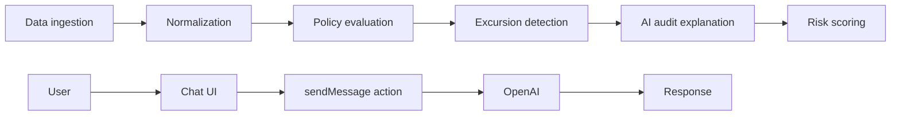

# Cold Chain Compliance Monitor

Enterprise-grade cold chain compliance for **Food** and **Pharmaceutical** industries. The app ingests IoT temperature data, detects excursions, scores risk, maintains an append-only audit log, and provides AI-driven insights—with a single source of truth and role-based dashboards.

## Main features

- Displays dashboard KPIs, temperature charts, excursion alerts, and AI insight cards; policy selector (Food | Pharma) and audit log viewer
- Data ingestion and normalization: upload CSV/JSON or use mock API; timestamps and identifiers are normalized into one source of truth in Convex
- Policy engine with configurable Food (HACCP/FSMA-style) and Pharma (GDP/GxP-style) rules—threshold, duration, and repeated-violation logic
- Excursion detection (threshold, duration-based, repeated minor violations) and risk scoring (Low/Medium/High, 0–100) per shipment
- Append-only audit log with optional AI-generated, regulator-friendly explanations; export to CSV for submission
- AI: OpenAI-powered excursion analysis, audit log explanations, policy recommendations, and an in-app cold-chain Q&A chat
- RBAC: Admin, Supervisor, Viewer with role-aware UI (policies and data upload gated by role)

## Tech stack

- **Frontend**: Next.js 14 (App Router), React, Tailwind CSS, Recharts
- **Backend / DB**: Convex (queries, mutations, actions, file storage)
- **AI**: OpenAI API via Convex actions (model: gpt-4o-mini)

## How AI/ML is implemented

All AI runs in **Convex actions**. The API key is stored in the Convex environment (`OPENAI_API_KEY`), not in the Next.js app. Model used: **OpenAI gpt-4o-mini**.

### Functionality

- **Excursion analysis**: When an excursion is detected, an internal action can generate a short, regulator-friendly explanation and corrective action. The result is stored in the `aiInsights` table (type `excursion_analysis`) and shown on the Dashboard and Shipment detail pages via `AIInsightCard`.
- **Audit log explanation**: For each new excursion, the system creates an audit log entry and schedules `explainAuditLog`. The action calls OpenAI to generate a one-sentence explanation and patches the audit log document with `aiExplanation`, visible on the Audit log page.
- **Policy recommendation**: The Convex action `recommendPolicy` (triggered from the Dashboard or Convex Dashboard) takes a summary of recent excursions and policy type (food/pharma) and suggests a policy tweak. The result is stored in `aiInsights` (type `policy_recommendation`) and can be shown in AI insight cards.
- **AI chat**: A global chat (`GlobalChat` / `Chatbox`) calls the `sendMessage` action with the user message and optional conversation history. The model answers questions about cold chain, HACCP/FSMA, GDP/GxP, excursions, and audit trails. Responses are not stored in the database; they are returned to the UI only.

### Interaction with data

- **Inputs**: Excursion data (shipmentId, summary, rule violated, severity, temperature, duration) and audit event metadata from Convex tables (`excursions`, `auditLogs`, `temperatureReadings` / policy engine). Chat uses only the user message and in-memory history passed from the client.
- **Outputs**: `aiInsights` table (excursion_analysis, policy_recommendation); `auditLogs.aiExplanation` field; chat returns a string to the client with no DB write.
- **Triggering**: Audit explanations are triggered automatically from `convex/excursions/detect.ts` when a new excursion is written (scheduler runs `explainAuditLog`). Excursion analysis and policy recommendation are wired from the pipeline or invoked manually (e.g. Convex Dashboard). Chat is user-initiated from the UI.



### Configuration

Set `OPENAI_API_KEY` in the [Convex Dashboard](https://dashboard.convex.dev) (Settings → Environment Variables) and redeploy. Without it, audit explanations and insight generation are skipped or return a friendly “not configured” message, and the chat explains that the assistant is not configured.

## Data and policies (summary)

Temperature and shipment data lives in Convex tables `temperatureReadings` and `shipments`; CSV/JSON uploads are normalized and merged. Policies are stored in the `policies` table; the engine in `convex/policies/engine.ts` evaluates readings against rules (e.g. min/max temp, max duration, repeated minor count). Food uses HACCP/FSMA-style framing; Pharma uses GDP/GxP-style. For details and sample data, see [docs/TESTING-WITH-REAL-DATA.md](docs/TESTING-WITH-REAL-DATA.md).

## Launching the app

**Clone:**

```bash
git clone <your-repo-url>
cd <project-directory>
```

**Install dependencies:**

```bash
npm install
```

**Environment:** Convex generates `.env.local` with `NEXT_PUBLIC_CONVEX_URL` when you run `npx convex dev`. For AI features, set `OPENAI_API_KEY` in the [Convex Dashboard](https://dashboard.convex.dev) (Settings → Environment Variables).

**Start:**

1. In one terminal: `npx convex dev` (sign in or create a Convex project if prompted; keep it running).
2. In another terminal, seed once: `npx convex run seed:run`.
3. Run the app: `npm run dev`.
4. Open [http://localhost:3000](http://localhost:3000).

For testing with real data and AI, see [docs/TESTING-WITH-REAL-DATA.md](docs/TESTING-WITH-REAL-DATA.md).

## Deploy

Production uses **Convex Cloud** and **Vercel**. Run `npx convex dev`, choose **Use cloud**, then push the repo to GitHub and import it in Vercel. Add `NEXT_PUBLIC_CONVEX_URL` in Vercel environment variables (from the Convex dashboard). Optional: create a production Convex deployment with `npx convex deploy --prod` and point Vercel Production at that URL.

## Troubleshooting

**"Failed to load SWC binary" (Windows):** The repo includes a `.babelrc` fallback—run `npm run dev` again. If it still fails, try a clean reinstall (`Remove-Item -Recurse -Force node_modules`, remove `package-lock.json`, `npm install`, `npm run dev`). Use 64-bit Node (`node -p "process.arch"` should print `x64`). If you see DLL errors, install the [x64 VC++ Redistributable](https://aka.ms/vs/17/release/vc_redist.x64.exe).

## Backend technologies

- [Convex](https://convex.dev) – backend, database, serverless functions
- [Vercel](https://vercel.com) – Next.js hosting (production)

## License & credits

MIT. Sample data in `data/mock/` is for demo use.
